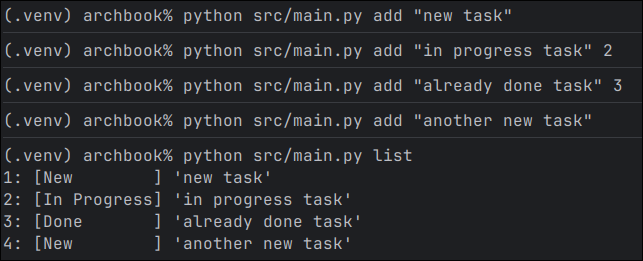
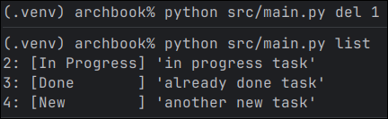
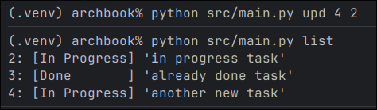
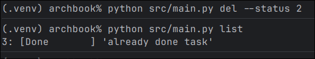
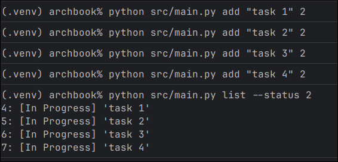
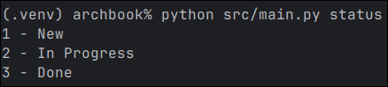

# TodoCLI

 Simple TODO app with CLI interface written in Python
 
## Commands

#### add

 Add new task, optionally you can set status:

 `add "task name"` - just new task  
 `add "task name" 3` - new task with status

#### del

 Removes task

 `del 1` - removes task with id equals 1  
 `del --status 2` - removes all tasks with status 2  
 `del --range 0 5 --status 3` - removes all tasks that have status 3 and id from 0 to 5

#### upd

 Updates status for task

 `upd 1 3` - update status for task 1 to 3  
 `upd --range 0 25 --status 2 3` - updates tasks with id from 0 to 25 with status 2 to status 3  

#### list

 Just show list of tasks

 `list` - show all tasks  
 `list --status 2` - show all tasks with status 2  
 `list --range 0 25` - show all tasks that have id from 0 to 25  

#### status

 Shows list of all statuses 

 `status` - print list of status to use

### Example

#### Add some tasks and print all of them

#### Delete task with ID 1

#### Update task 4 to status 2 (In progress)

#### Delete all tasks with status 2 (In Progress)

#### Add some tasks and print all tasks with status 2

#### Print status codes with descriptions

## Author
 Maks Makuta (C) 2025  
 MIT Licence